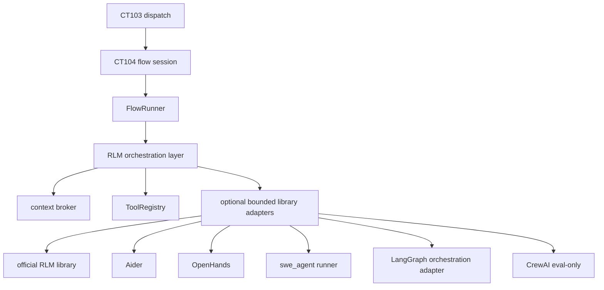

# CT104 RLM-First Adapter Plan

This document **extends** [ct104.md](ct104.md). It does not replace or walk back the existing CT104 design. CT104 execution code lives in `src/agent_workers/`. Shared schemas live in `src/agent_shared/`. CT103 owns webhook intake, event ledger, state reducer, intent parser, dispatch, and result ingest. CT104 owns RQ workers, session artifacts, FakeRLMEngine, RLM execution, report worker, and the future verify sandbox.

## Design question

> How do we integrate existing libraries such as the official RLM library, Aider, OpenHands, SWE-agent-style tools, CrewAI, or LangGraph without replacing the RLM-first architecture?

**Answer:** Keep RLM as the orchestrator. External libraries are optional bounded tools or subsystems. CT104 remains the policy, logging, safety, artifact, and approval boundary.

CT104 follows a GitLab-like flow-session logging model, but uses Gitea comments, filesystem artifacts, and RQ workers instead of GitLab's managed workflow service.

## V1 priority

Read-only flows first:

- `/agent inspect`
- `/agent explain`
- `/agent review`
- `/agent plan`

First code gate: `/agent inspect` using `FakeRLMEngine` with zero model API calls (Step C).

Homelab posture:

- **Relaxed mode** for read-only flows
- **Strict write mode** for `/agent fix` and `/agent verify`
- Write/verify flows must **fail closed** if sandbox is unavailable

## Architecture hierarchy

```text
CT103 dispatch
  -> CT104 flow session
    -> FlowRunner
      -> RLM orchestration layer
        -> context broker
        -> ToolRegistry
        -> optional bounded library adapters
             - official RLM library
             - Aider
             - OpenHands
             - SWE-agent-style runner
             - LangGraph (orchestration adapter)
             - CrewAI (eval-only)
```



**Diagram note:** LangGraph and CrewAI appear under adapters for evaluation purposes, but they are **orchestration adapters**, not repo-editing tools. LangGraph is primarily a possible `FlowRunner` implementation detail. CrewAI is evaluation-only in V1.

### Anti-pattern (do not do this)

```text
CT103 dispatch
  -> pick random backend
  -> bypass RLM
```

Do not make RLM just one interchangeable backend among many.

## Naming and abstraction split

### Preferred naming

```text
RLMEngine
  FakeRLMEngine
  OfficialRLMEngine
  MinimalLocalRLMEngine
  RLMWithToolAdapters
```

Do **not** use this as the primary abstraction:

```text
AgentExecutionBackend
  FakeBackend
  AiderBackend
  OpenHandsBackend
  RLMBackend
```

That makes RLM appear to be just one peer backend.

### Split abstractions

| Abstraction | Responsibility |
|-------------|----------------|
| `FlowRunner` | Deterministic CT104 job lifecycle (bootstrap, policy, engine, artifacts, report enqueue) |
| `RLMEngine` | Recursive reasoning, decomposition, synthesis |
| `ExecutionTool` / `ToolAdapter` | Bounded helper invoked by RLM (Aider, OpenHands, SWE-agent) |
| `FlowOrchestrationAdapter` | Optional sequencing helper (LangGraph, CrewAI eval) — not a repo-editing tool |
| `SandboxBackend` | Isolated execution for verify/write flows |
| `IndexBackend` | Deterministic repo/code lookup |

### LangGraph / CrewAI stance

- LangGraph/CrewAI may be evaluated as flow orchestration helpers or sequencing utilities.
- They should **not** become top-level execution backends unless an explicit admin-only spike proves that doing so reduces complexity without bypassing RLM policy boundaries.
- LangGraph is primarily a possible `FlowRunner` implementation detail, not a tool called by the RLM for repo edits.
- **CrewAI is evaluation-only in V1.** Do not enable autonomous CrewAI crews or swarm behavior. If used later, it must run behind `RLMEngine` and obey the same child-agent depth/concurrency limits (protects 3080/2070 GPU constraints).

### Current vs target

Today `src/agent_workers/jobs/rlm_root.py` is the flow runner (~170 lines). Spike 0 extracts it to `flows/runner.py` without changing runtime behavior.

## Risk classes

Already defined in `src/agent_shared/constants.py`:

| Risk class | Typical flows |
|------------|---------------|
| `read_only` | inspect, explain |
| `read_only_with_repo_context` | review |
| `planning_only` | plan |
| `write_patch` | fix |
| `executes_untrusted_code` | verify |

## Session artifacts

Required run artifacts (see [run-artifacts.md](run-artifacts.md)):

- `input_job.json`
- `bootstrap.json`
- `system_context.json`
- `capabilities.json`
- `metadata.json`
- `policy_source.json`
- `effective_policy.json`
- `context_receipt.json`
- `session_events.jsonl`
- `rlm_trace.jsonl`
- `redaction_report.json`
- `final_report.md`
- `result.json`
- `error.json` (on failure)

Spike 0 and later spikes must preserve existing required artifact **filenames**. New fields such as `engine` may be **additive only** unless schemas and tests are updated intentionally.

## Proposed package layout

Target tree under `src/agent_workers/`:

```text
flows/
  runner.py

rlm/
  engine.py
  fake_engine.py
  official_engine.py
  minimal_engine.py
  prompts.py
  tools.py
  budget.py
  trace.py

tools/
  registry.py
  base.py
  aider_tool.py
  openhands_tool.py
  swe_agent_tool.py
  langgraph_tool.py
  crewai_tool.py

sandbox/
  base.py
  verify.py
  isolation.py
  runner.py

index/
  base.py
  repo_graph.py
  symbol_index.py
  text_index.py
  test_map.py

artifacts/
  writer.py
  session_events.py
  errors.py

security/
  redactor.py

runtime/
  capabilities.py

context/
  broker.py
```

**Not every file needs to be implemented immediately.** The key next refactor is to put `FakeRLMEngine` behind the `RLMEngine` interface and add a `ToolRegistry` that can later expose Aider/OpenHands/etc. as tools.

### Migration map

| Current | Target | Spike |
|---------|--------|-------|
| `rlm/engine.py` | expanded protocol + engine registry | 0 |
| `rlm/fake_engine.py` | implements `RLMEngine` with `name` | 0 |
| `rlm/minimal_engine.py` | implements `RLMEngine` with `name` | 0 |
| `rlm/tools.py` | internal RLM tools; `tools/registry.py` owns `ExecutionTool` dispatch | 0 skeleton |
| `jobs/rlm_root.py` | thin RQ entrypoint calling `flows/runner.py` | 0 |
| `rlm/official_engine.py` | new stub | 1 |
| `tools/*_tool.py` | new stubs, disabled by default | 3–5 |

## Core interfaces

### RLMEngine

Current baseline (`src/agent_workers/rlm/engine.py`):

```python
def run(self, job: dict, workspace: Path, policy: dict) -> RLMResult
```

Target protocol:

```python
class RLMEngine(Protocol):
    name: str

    def run(
        self,
        *,
        job: RLMJob,
        workspace_path: str,
        artifact_dir: str,
        policy: EffectivePolicy,
        context_broker: ContextBroker,
        tools: ToolRegistry,
    ) -> RLMResult:
        ...
```

Spike 0 keeps a compatibility shim (dict/Path internally) while the documented contract is the expanded form. `get_engine()` becomes an engine registry keyed by `execution_strategy`.

### ExecutionTool

```python
class ExecutionTool(Protocol):
    name: str
    risk_classes: set[RiskClass]

    def run(
        self,
        *,
        request: ToolRequest,
        workspace_path: str,
        policy: EffectivePolicy,
        session: SessionEventWriter,
    ) -> ToolResult:
        ...
```

### ToolRegistry behavior

Build on `src/agent_workers/tools/registry.py` and `SessionEventWriter`:

- Tool calls must be policy-checked (`allowed_tools`, `protected_paths`, `risk_class`)
- Unknown tools fail closed with `TOOL_CALL_REJECTED`
- Tool calls emit `request_id`
- Tool calls write to `session_events.jsonl` (`tool_call`, `tool_result`)
- Tool output is redacted before artifacts or comments
- Tools cannot bypass `EffectivePolicy`
- Tools cannot bypass the context broker for repo reads unless explicitly allowed
- External libraries are never given raw secrets by default
- **ExecutionTool implementations must not call Gitea directly.** They return `ToolResult` / patch / logs to CT104; `worker-report` handles Gitea comments and reporting

### Patch-producing tool output normalization

Patch-producing tools (Aider, OpenHands, SWE-agent) must normalize output. Do not let each tool invent its own artifact format:

- `patch.diff`
- `changed_files.json`
- `tool_summary.md`
- `tool_raw_log.txt` (optional) or normalized session events

Stored under the run artifact root or `tool_logs/{tool_name}/`.

### Tool logging vs session_events

External tool raw logs may be stored under `tool_logs/{tool_name}/`, but they **do not replace** `session_events.jsonl`. CT104 must also emit normalized `session_events.jsonl` entries for: start, stop, inputs, outputs, exit code, and artifact paths.

## execution_strategy

For V1, `execution_strategy` is **platform-owned configuration**, not repo-owned configuration. Repo-local `.agent/flows.yml` may request capabilities, but **cannot select arbitrary external backends**. Later, protected-base repo config may opt into approved tools only from a platform allowlist.

This prevents a target repo from saying "use OpenHands with full permissions."

```yaml
execution_strategy:
  default_engine: official_rlm
  fallback_engine: minimal_local_rlm
  test_engine: fake_rlm

  external_agent_backends:
    mode: rlm_tool_only
    allowed:
      - aider
      - openhands
      - swe_agent

  direct_backend_execution:
    allowed: false
    exception: platform_admin_spike_only
```

### Meaning

- `FakeRLMEngine` remains the deterministic platform test engine (`test_engine`)
- `OfficialRLMEngine` is the first real target (`default_engine`) — a **candidate**, not a gate that blocks `/agent inspect` after FakeRLMEngine passes Step C
- `MinimalLocalRLMEngine` is a **first-class RLM-first fallback** if the official RLM library is too heavy or awkward with local model endpoints — not a second-class failure path
- Aider/OpenHands/SWE-agent are callable only as bounded tools from the RLM flow (`rlm_tool_only`)
- Direct non-RLM execution is disabled except for explicit admin-only spikes

### Mapping to current config

Today's `model_policy` on `RLMJob` and `MODEL_ROUTING_POLICY` env in worker settings:

| Value | Engine |
|-------|--------|
| `fake` | `FakeRLMEngine` (test_engine) |
| `balanced`, `local`, `readonly` | `MinimalLocalRLMEngine` (fallback) |
| `official` (future) | `OfficialRLMEngine` (candidate) |

**Engine selection priority (read-only flows):** FakeRLMEngine (Step C gate) → OfficialRLMEngine candidate → MinimalLocalRLMEngine fallback.

## Per-flow behavior

### `/agent inspect`

```text
FakeRLMEngine first.
OfficialRLMEngine candidate later.
No Aider.
No OpenHands.
No patch.
No tests.
No sandbox required.
```

Inspect does **not** wait on official RLM after FakeRLMEngine passes Step C.

### `/agent explain`

```text
OfficialRLMEngine candidate.
MinimalLocalRLMEngine fallback.
Context broker.
Compiled summaries.
Graph/index lookup.
No coding backend needed.
```

### `/agent review`

```text
OfficialRLMEngine candidate.
Fixed review context packet.
Optional serialized child RLM investigation.
No Aider/OpenHands by default.
No tests unless sandboxed later.
```

### `/agent plan`

```text
OfficialRLMEngine candidate.
Repo graph + roadmap/work-item context.
Planner proposes Gitea-visible work items.
No coding backend.
No auto-execution.
```

### `/agent fix`

```text
OfficialRLMEngine root.
RLM decomposes task.
RLM selects files/context through the context broker.
RLM may call AiderTool or OpenHandsTool for patch proposal.
Patch is captured as patch.diff (normalized).
Patch is verified by CT104 verify sandbox.
No direct push to main.
No merge.
Human approval required.
```

Fails closed if sandbox is unavailable.

### `/agent verify`

```text
Verification is deterministic first.
No RLM required to run tests.
RLM may summarize verification failures afterward.
Sandbox mandatory.
No secrets.
No network by default.
```

Fails closed if sandbox is unavailable.

## What to reuse vs what remains custom

### Keep custom

```text
CT103 webhook intake
event ledger
state reducer
intent parser
dispatch payload
agent_shared schemas
risk-class enforcement
policy loading from protected branch
run artifacts
session_events.jsonl
redaction
Gitea comments/reporting
approval gates
verification sandbox requirement
CT103 public surface restrictions
```

Libraries must not replace CT104's policy/logging/artifact boundary.

### Reuse or wrap

```text
official RLM library
Aider
OpenHands
SWE-agent-style patch runner
LangGraph
CrewAI
tree-sitter
ctags
ripgrep
networkx
Semgrep
Gitleaks
Ruff/pytest/etc.
```

Libraries should reduce implementation work **inside** CT104, but they must not replace CT104's policy/logging/artifact boundary.

## Phased spike plan

### Spike 0: preserve current behavior

**Goal:**

```text
No behavior change.
FakeRLMEngine still powers /agent inspect.
All existing Step C acceptance criteria pass.
```

**Work:**

```text
Introduce RLMEngine interface with engine registry.
Move FakeRLMEngine behind that interface.
Add ToolRegistry skeleton in tools/.
Extract FlowRunner from rlm_root.py.
Record engine name in metadata.json and result.json (additive).
```

**Constraints:**

- Preserve existing required artifact filenames
- New fields additive only unless schemas/tests updated intentionally
- No external tools enabled

### Spike 1: Official RLM candidate

**Goal:**

```text
Can OfficialRLMEngine run /agent inspect or /agent explain with local model endpoint?
```

**Constraints:**

```text
read-only only
no writes
no tests
no external coding backend
small active prompt budget
session_events logging
redaction
```

If the official RLM library is awkward with local endpoints, `MinimalLocalRLMEngine` remains a valid RLM-first fallback.

**Requires decision record** (see below).

### Spike 2: MinimalLocalRLMEngine

**Goal:**

```text
Fallback RLM loop for local 3080/2070 models if official library is not practical.
```

**Constraints:**

```text
serialized bounded recursion
max_depth initially 0 or 1
no child swarm
structured output validation
```

### Spike 3: AiderTool

**Goal:**

```text
Can RLM call Aider as a bounded patch proposal tool in an isolated workspace?
```

**Constraints:**

```text
only allowed for write_patch risk class
no push
output patch.diff, changed_files.json, tool_summary.md, normalized session_events
verify sandbox required before reporting success
```

**Requires decision record.**

### Spike 4: OpenHandsTool

**Goal:**

```text
Can RLM delegate a bounded implementation subtask to OpenHands while CT104 retains artifacts, policy, and report control?
```

**Constraints:**

```text
only in isolated workspace
no secrets
no direct merge
no direct Gitea calls
logs normalized into session_events.jsonl
```

**Requires decision record** (OpenHands install footprint is a key evaluation target).

### Spike 5: LangGraph/CrewAI evaluation

**Goal:**

```text
Determine whether LangGraph or CrewAI helps implement flow state or agent sequencing inside FlowRunner.
```

**Constraints:**

```text
Do not adopt unless it reduces complexity versus RQ + FlowRunner.
CrewAI: evaluation-only in V1; no autonomous crews.
LangGraph: primarily a FlowRunner implementation detail, not an RLM repo-editing tool.
```

**Requires decision record.**

## External library decision record requirement

Each external library spike (Spikes 1–5) must produce a short decision record (ADR or decision note) covering:

- library name/version
- license compatibility
- install footprint (container image size, runtime memory/CPU)
- GPU/model endpoint assumptions
- whether it requires internet during normal execution
- model compatibility (local Ollama/vLLM endpoints)
- sandbox behavior
- logging integration (normalized session_events, not tool-specific logs only)
- policy bypass risks
- keep/drop recommendation

## Do not do this

```text
Do not replace CT104 with OpenHands.
Do not replace CT104 with Aider.
Do not let external libraries post directly to Gitea without CT104 report policy.
Do not let external libraries read secrets by default.
Do not let external libraries push branches directly in V1.
Do not bypass session_events.jsonl.
Do not bypass redaction.
Do not bypass EffectivePolicy.
Do not bypass risk_class restrictions.
Do not enable /agent fix before OS-enforced sandbox exists (Slice 5.6a SRT spike + SandboxBackend wiring; allowlist alone is not enough).
Do not enable direct non-RLM backend execution except admin-only spikes.
Do not dynamically install Aider/OpenHands/SWE-agent/LangGraph/CrewAI during normal CT104 runs. Worker images should be prebuilt with approved tool versions.
Do not let tool-specific raw logs replace session_events.jsonl.
Do not enable autonomous CrewAI crews in V1.
Do not treat LangGraph as a default repo-editing RLM tool.
```

External tools must not call Gitea directly. Return structured results to CT104; `worker-report` owns comments.

## Known gaps (intentional future work)

- Adapter tool modules (Aider/OpenHands as RLM tools) — Spikes 2–5
- `GITEA_BOT_TOKEN` Gitea API client on CT103 — stub only (PR/label automation)
- [rlm-runtime.md](rlm-runtime.md) mentions "RLM OR Aider/OpenHands" at worker level — this plan clarifies Aider/OpenHands are **tools under RLM**, not alternate top-level runtimes

## Next implementation task

**Spike 1 (completed, homelab verified 2026-06-14):** `OfficialRLMEngine` for read-only inspect/explain with repo clone, Ollama, and Gitea comment-back. See [decisions/spike1-official-rlm-library.md](decisions/spike1-official-rlm-library.md).

**Spike 2 (next):** Harden `MinimalLocalRLMEngine` as first-class fallback — bounded recursion (max_depth 0–1), structured output validation, real model calls without `rlms` REPL when official library is awkward.

Homelab settings for official inspect:

1. `MODEL_ROUTING_POLICY=official` on **CT103** (dispatch policy)
2. `MODEL_3080_BASE_URL` / `MODEL_3080_NAME` on **CT104**
3. `GITEA_AGENT_TOKEN` + `GITEA_AGENT_COMMENT_ENABLED=true` on CT104
4. HTTP git credentials mounted into `worker-rlm-root` (see [ct104.md](ct104.md))

## Related docs

- [ct104.md](ct104.md) — CT104 worker platform baseline
- [run-artifacts.md](run-artifacts.md) — artifact contract
- [security.md](security.md) — credential and prompt-injection boundaries
- [agent-config.md](agent-config.md) — repo policy and risk classes
- [rlm-runtime.md](rlm-runtime.md) — homelab RLM placement
- [agent-worker.md](agent-worker.md) — worker role in the stack
